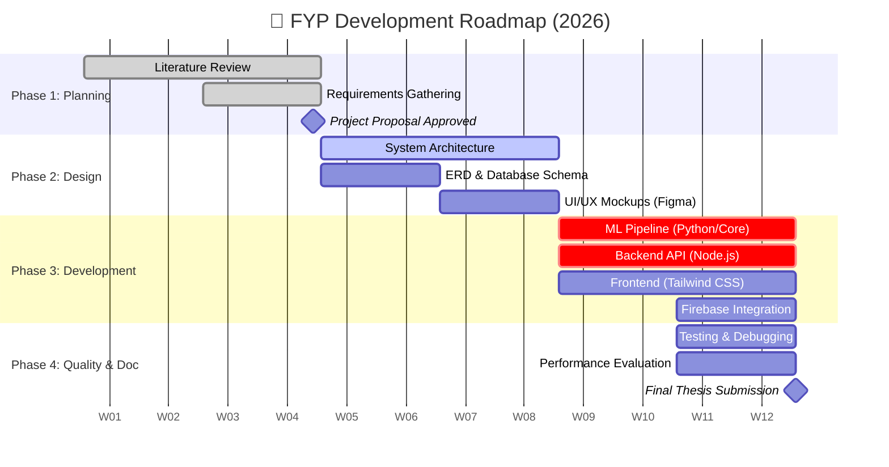

```mermaid
gantt
    title 🚀 FYP Development Roadmap (2026)
    dateFormat  YYYY-MM-DD
    axisFormat  W%U
    
    %% Colors: crit = red, active = blue, done = grey

    section Phase 1: Planning
    Literature Review          :done, p1, 2026-01-01, 4w
    Requirements Gathering     :done, p2, 2026-01-15, 2w
    Project Proposal Approved  :milestone, m1, 2026-01-28, 0d

    section Phase 2: Design
    System Architecture        :active, d1, 2026-01-29, 4w
    ERD & Database Schema      :d2, 2026-01-29, 2w
    UI/UX Mockups (Figma)      :d3, 2026-02-12, 2w

    section Phase 3: Development
    ML Pipeline (Python/Core)  :crit, dev1, 2026-02-26, 4w
    Backend API (Node.js)      :crit, dev2, 2026-02-26, 4w
    Frontend (Tailwind CSS)    :dev3, 2026-02-26, 4w
    Firebase Integration       :dev4, 2026-03-12, 2w

    section Phase 4: Quality & Doc
    Testing & Debugging        :t1, 2026-03-12, 2w
    Performance Evaluation     :t2, 2026-03-12, 2w
    Final Thesis Submission    :milestone, m2, 2026-03-26, 0d
```
