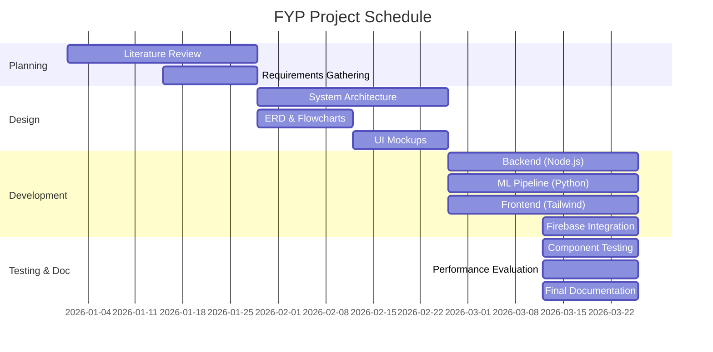

```mermaid
gantt
    title FYP Project Schedule
    dateFormat  YYYY-MM-DD
    section Planning
    Literature Review       :a1, 2026-01-01, 4w
    Requirements Gathering  :a2, 2026-01-15, 2w
    section Design
    System Architecture     :b1, 2026-01-29, 4w
    ERD & Flowcharts        :b2, 2026-01-29, 2w
    UI Mockups              :b3, 2026-02-12, 2w
    section Development
    Backend (Node.js)       :c1, 2026-02-26, 4w
    ML Pipeline (Python)    :c2, 2026-02-26, 4w
    Frontend (Tailwind)     :c3, 2026-02-26, 4w
    Firebase Integration    :c4, 2026-03-12, 2w
    section Testing & Doc
    Component Testing       :d1, 2026-03-12, 2w
    Performance Evaluation  :d2, 2026-03-12, 2w
    Final Documentation     :d3, 2026-03-12, 2w
```
